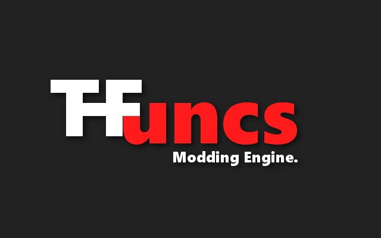

# Truckers Functions
##### It works in TruckersMP.
Advanced modding engine and native plugins loader for Euro Truck Simulator 2.

####  Installation:
    Put files dinput8.dll to your root game folder.
    win32 >> bin\win_x86
    win64 >> bin\win_x64

####  Using:
    Put your mods\plugins to Documents\Euro Truck Simulator 2\TFuncs
    Enjoy!

#### Download:
`[Latest Release](https://github.com/Stearells/tfuncs-public/releases/download/0.1.20/TFuncs_Release.tar "Latest Release")`
`[All Releases](https://github.com/Stearells/tfuncs-public/releases "All Releases")`
